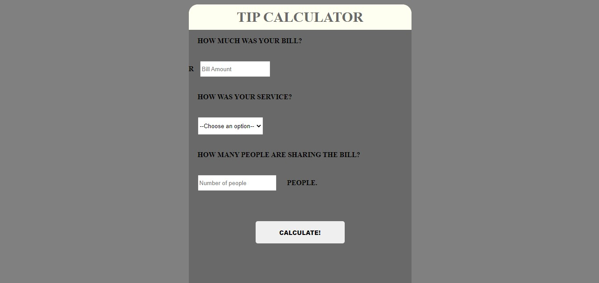

<h1>Resturant Tip calculator</h1>

This program calculates the required tip at a resturant which is to be added to the total bill

This tip calculator performs basic functions such as

<ul>
    <li>Prompting the user to enter the amount of the bill;</li>
    <li>Prompting the user to rate the quality of the service;</li>
    <li>Prompting the user to enter the number of people that are to share the bill;</li>
    <li>Calculates the total tip to be paid based on the information provided.</li>
</ul>

<h1>Steps to execute this calculator</h1>
<ul>
    <li>Open up the index.html</li>
</ul>

<h1>Technologies used</h1>
<ul>
    <li>HTML</li>
    <li>CSS</li>
    <li>JavaScript</li>
</ul>